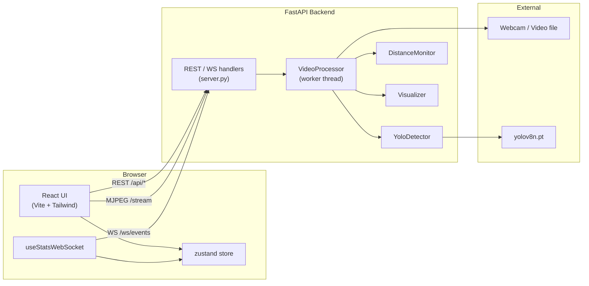
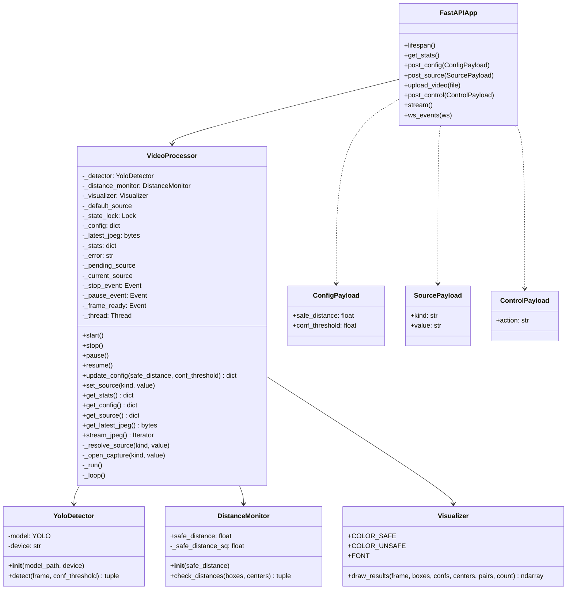
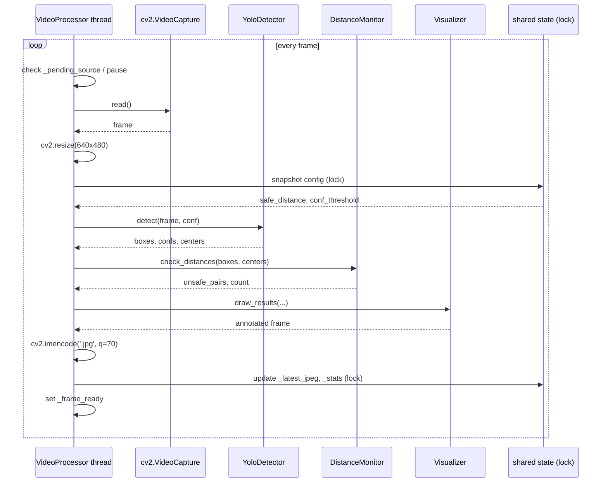
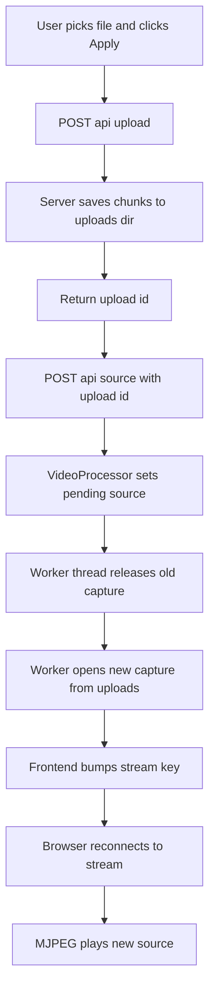
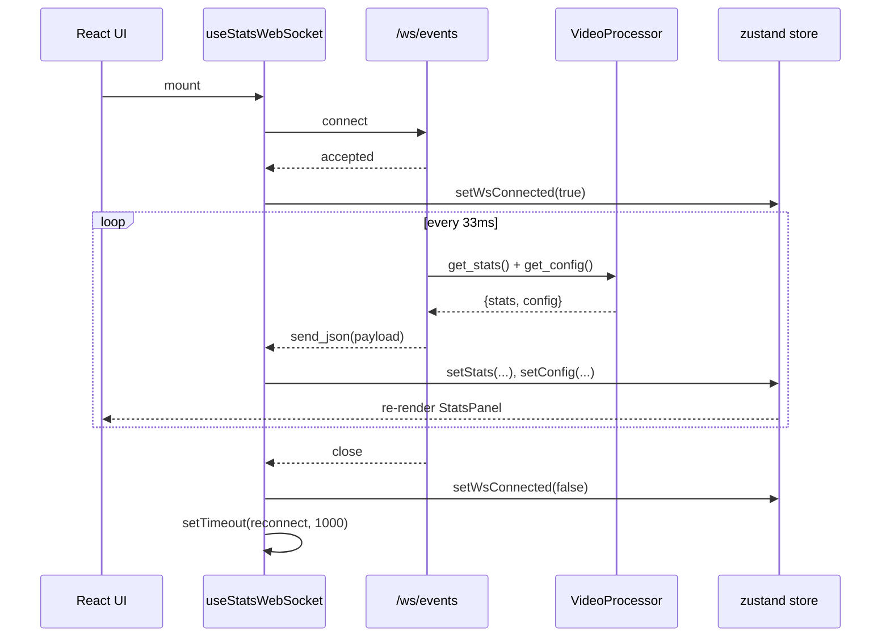
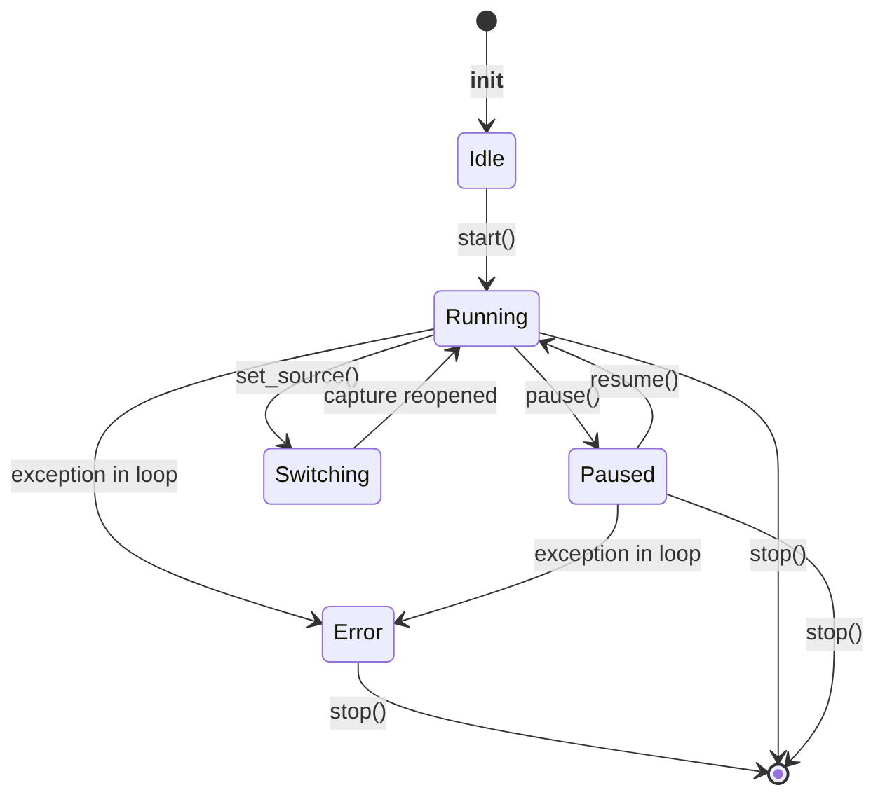
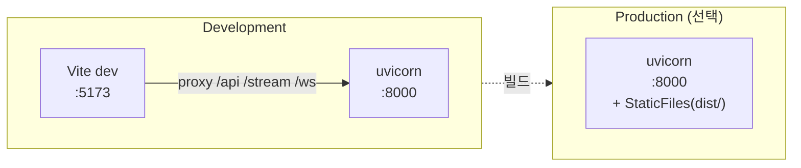
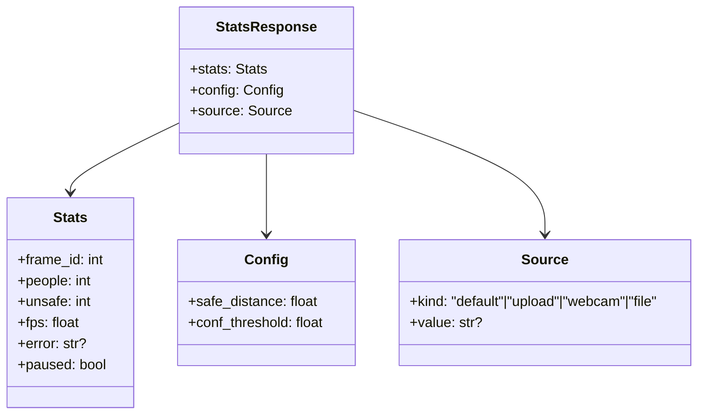

# UML 다이어그램

Mermaid 기반 다이어그램 모음. GitHub / VS Code / IntelliJ에서 바로 렌더링됩니다.

## 1. 컴포넌트 다이어그램

## 2. 클래스 다이어그램

## 3. 시퀀스 다이어그램 — 프레임 처리 루프

## 4. 시퀀스 다이어그램 — 비디오 업로드 플로우

## 5. 시퀀스 다이어그램 — 실시간 통계 갱신

## 6. 상태 다이어그램 — VideoProcessor

## 7. 배포 다이어그램

## 8. 데이터 구조

