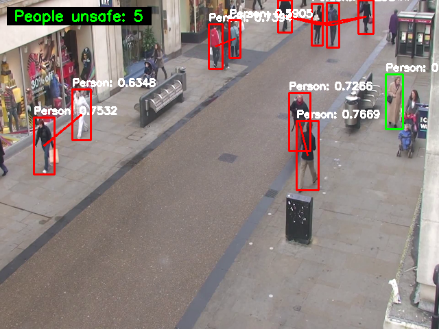

# Social Distancing Monitor with YOLOv8

사회적 거리두기 모니터링 시스템은 YOLOv8 객체 감지 모델을 사용하여 비디오에서 사람들을 감지하고, 사람들 간의 거리를 계산하여 안전 거리를 위반하는 경우를 식별합니다.



## 주요 기능

* YOLOv8 모델을 사용한 실시간 사람 감지
* 사람들 간의 거리 계산 및 안전 거리 위반 탐지
* 시각적 표시 (녹색/빨간색 경계 상자, 거리 표시선)
* 안전 거리 위반 사람 수 카운터

## 요구 사항

* Python 3.8+
* Ubuntu 22.04 (권장, 다른 OS에서도 작동 가능)
* CUDA 지원 GPU (권장, CPU에서도 실행 가능)

필요한 패키지는 `requirements.txt`에 나열되어 있습니다.

## 설치 방법

### 1. Miniconda 설치

```bash
# 필요한 패키지 설치
sudo apt update
sudo apt install -y wget curl

# Miniconda 설치 스크립트 다운로드
wget https://repo.anaconda.com/miniconda/Miniconda3-latest-Linux-x86_64.sh -O ~/miniconda.sh

# 설치 스크립트 실행
bash ~/miniconda.sh -b -p $HOME/miniconda

# Miniconda 초기화 및 쉘 설정
~/miniconda/bin/conda init bash

# 쉘을 새로고침
source ~/.bashrc
```

### 2. 가상 환경 생성 및 패키지 설치

```bash
# YOLOv8 전용 conda 환경 생성
conda create -n yolov8 python=3.10 -y

# 환경 활성화
conda activate yolov8

# 필요한 패키지 설치
pip install -r requirements.txt
```

## 사용 방법

1. 프로젝트 디렉토리에 비디오 파일을 `small.mp4`로 저장하거나 `config.py`에서 비디오 경로를 변경합니다.

2. 다음 명령으로 프로그램을 실행합니다:
   ```bash
   python main.py
   ```

3. 프로그램이 실행되면 비디오가 화면에 표시되고, 감지된 사람들이 경계 상자로 표시됩니다:
   - 녹색 박스: 안전 거리를 유지하는 사람
   - 빨간색 박스: 안전 거리를 위반하는 사람
   - 빨간색 선: 안전 거리를 위반하는 사람들 간의 연결

4. 'q' 키를 누르면 프로그램이 종료됩니다.

## 설정 변경

`config.py` 파일에서 다음 설정을 변경할 수 있습니다:

* `YOLOV8_MODEL_PATH`: 사용할 YOLOv8 모델 경로 (기본값: "yolov8n.pt")
* `VIDEO_PATH`: 입력 비디오 경로 (기본값: "small.mp4")
* `SAFE_DISTANCE`: 안전 거리 임계값 (픽셀 단위, 기본값: 75.0)
* `CONFIDENCE_THRESHOLD`: 객체 감지 신뢰도 임계값 (기본값: 0.5)

## 파일 구조

```
social_distancing_monitor/
│
├── main.py              # 메인 스크립트
├── detector.py          # YOLOv8 객체 감지 모듈
├── distance_monitor.py  # 거리 계산 및 모니터링 모듈
├── visualizer.py        # 시각화 모듈
├── config.py            # 설정 변수 모듈
│
├── requirements.txt     # 필요한 패키지 목록
└── README.md            # 프로젝트 설명
```

## 주의 사항

* 객체 감지 성능은 하드웨어, 모델 크기, 비디오 해상도에 따라 달라질 수 있습니다.
* 정확한 물리적 거리를 계산하기 위해서는 카메라 보정이 필요합니다. 현재 구현은 픽셀 단위 거리를 사용합니다.
* 더 큰 YOLOv8 모델(m, l, x)을 사용하면 정확도가 향상되지만 처리 속도가 느려질 수 있습니다.
